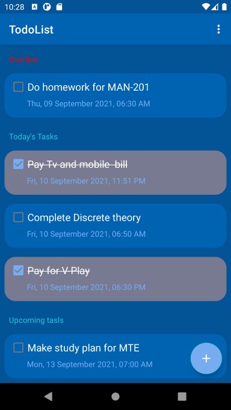
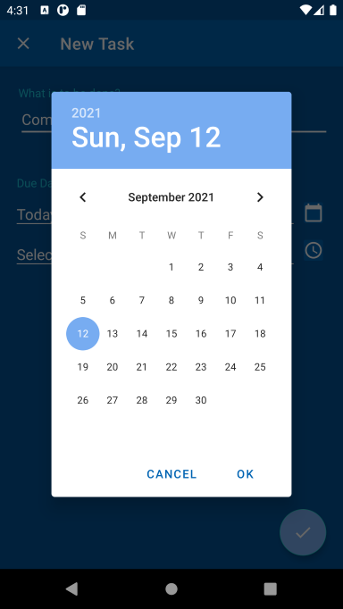
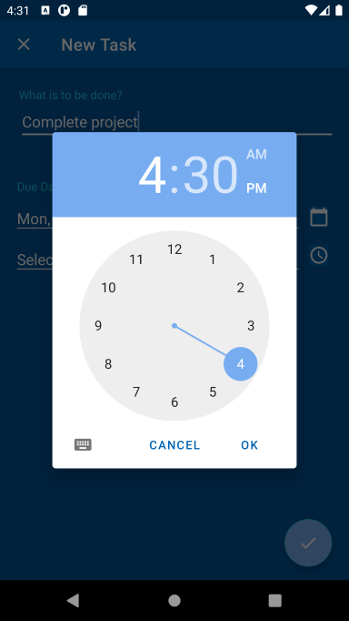
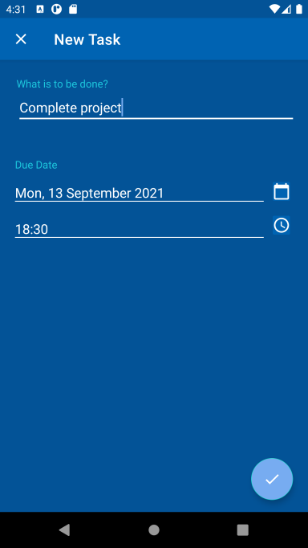

# ToDoList
Todo List App with MVVM architecture(using Room Database)

## How to use
>Click the button at the bottom right corner to add an task. 

>Fill in the details. Click on the calendar button to choose due date and the clock button to choose due time

  

>Click the save button to save the task. Then it will displayed as either "Overdue" , "Today's tasks", "Upcoming tasks" depending upn the due date.
>On clicking on any task we can edit the task and change the description, due date or due time.
>On clicking on the menu options(top right), we get the option to delete all tasks
